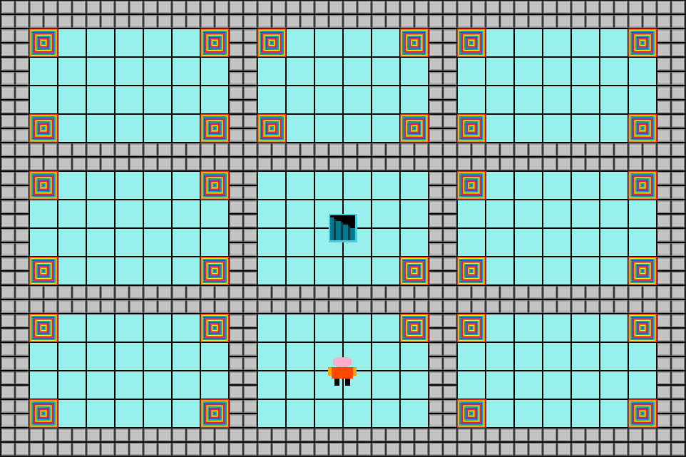
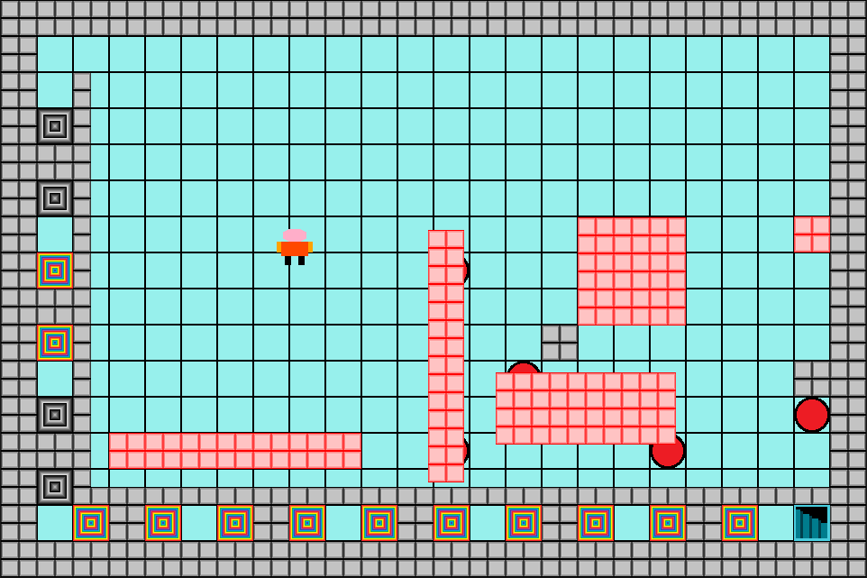

# Not Another Puzzle Game

A small game I wrote for school a couple of years ago in C, using Allegro. The player navigates their character through a series of (four) levels, each one presenting a different puzzle they must solve using various interactive features (portals, icy floors, movable blocks and buttons...)

## Installation

Requires Allegro

## Instructions

Use arrow keys to move character, left ctrl to push blocks and left shift to pull blocks. Detailed instructions given on startup

## Credits

Game and graphics designed by Nicholas Sunderland, 2014
